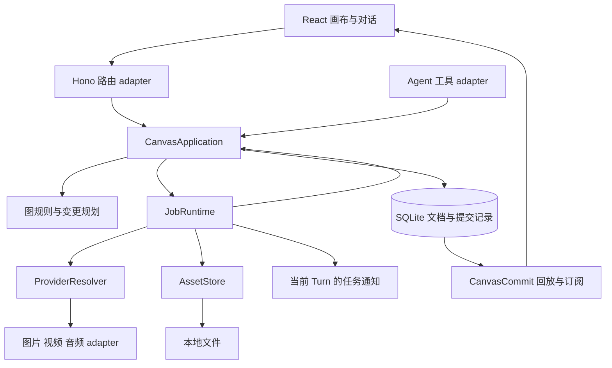

# Reizo Studio 架构提升规划

本规划面向本地优先的通用创作工作台，覆盖对话 Agent、画布、技能、自动化及工作区。电商套图是优先验证的复杂组合场景，不是产品边界。目标是让操作、任务和资产版本各有明确的状态来源，使用户操作与 Agent 操作遵守同一套规则，让电商、封面、音视频及其他工具复用共同基础。

建议继续采用 Electron 内的模块化单体：Hono 承担传输，SQLite 承担持久状态，文件系统承担当地产物，React 承担交互。先形成可靠的模块 interface，再按实际性能测量决定是否把重计算移入 worker 或 Electron utility process。

状态：前七批覆盖基础命令、画布同步、媒体任务持久化与并发调度、通用媒体资产层，以及跨画布复用和固定版本引用，其余阶段继续作为规划。核对基线为 2026 年 10 月 2 日的 `587190e`。基线检查中，类型检查通过，88 个测试文件中的 568 个单测通过，API 冒烟通过；Lint 有 148 个错误和 251 个警告。下面的现状证据描述该基线，实施后的变化见进度记录。

## 第一批实施进度

本批新增 CanvasApplication，HTTP 节点和连线路由与 Agent 结构工具共用校验、事务与广播。Agent 新增节点及引用连线、分镜结构创建支持整体提交；失败时回滚并丢弃尚未发布的事件。SQLite 新增 command receipt 表，HTTP 使用 Idempotency Key，Agent 使用 operationId；相同请求重试返回原结果，复用 ID 提交不同内容返回冲突。数据库重新打开后回执仍有效。

图片生成接入 NodeJobs，使用独立任务身份校验结果写入资格，传递 AbortSignal；重跑、取消或删除会撤销旧任务的写入资格。取消保留已有资产，生成中编辑参数保留原输入 hash，新产物记录实际 model。流水线结束统计成功、失败和跳过，停止不再被显示为全部完成；旧批次不能发布覆盖新批次的结束事件。后台监听覆盖图片的 node_output 和 node_updated 完成事件，并清除删除节点的监听。

Lint 加入 TypeScript 路径解析与现有 Hooks 指令所需插件，修正少量存量错误，基础命令现已可通过。新增 18 个行为测试覆盖整体回滚、请求幂等、数据库重开、HTTP 与 Agent 调用、迟到结果、取消、删除、输入修改、批次统计和后台通知。

验证：92 个测试文件、586 个单测通过，类型检查和 API 冒烟通过；Lint 无错误，存量警告继续保留。生成场景使用可控 provider 和临时 SQLite、文件目录完成，未调用付费模型。

第一批阶段的任务身份保存在进程内；图片执行记录及启动协调在第三批完成，视频与音频的持久执行器和统一配额继续推进。

## 第二批实施进度

CanvasCommit 的持久批次协议与客户端接入已实现。Repository 每次外层事务只分配一个画布 revision，将节点、连线、受影响节点的 dirty 投影与提交日志一起保存；命令回执也位于同一事务。嵌套 savepoint 失败时丢弃对应的 revision 分配与变更，日志写入失败会连同文档和回执一起回滚。提交观察者在事务结束后收到有序通知，异常不会撤销已经成功的写入。

新增 v2 stream，使用 SQLite 中最近 1000 个 revision 的完整提交回放，兼容原 v1 接口与后台任务监听。游标过期、内部缺口、损坏日志或服务实例变化时，客户端重取权威快照。phase、proposal 和运行进度属于独立活动消息，不推进文档游标；同一进程内重连会恢复仍在运行的图任务进度，进程重启不会恢复过期活动。

前端一次应用整批文档变更，保留未受影响节点的对象引用。已中断连接、过期快照和后到的 HTTP 回应不能覆盖新状态。新增 CanvasLocalEdits 管理尚未确认的用户字段，后台结果不会覆盖正在拖动、缩放或编辑的值；PATCH 通过 mutationId 确认字段，旧确认不能清除新编辑，同节点请求依次提交。失败时恢复已提交状态；快照确认处理漏收提交和确认先后顺序。手势过程只更新内存，结束时写入。

验证：100 个测试文件、649 个单测通过，类型检查和 API 冒烟通过，Lint 无错误、保留 251 个存量警告。本批新增 63 个测试覆盖事务日志、回放、游标、stream 清理、HTTP 响应隔离、编辑确认与手势。另用临时数据目录启动 Electron，确认后台 PATCH 能实时到达画布；实际鼠标拖动中收到后台更新时位置保持，松手后数据库记录了新坐标。验证未调用付费模型。

第二批之后，图片任务持久化及中断协调在第三批实施。自由画布中仍由客户端组合的多请求操作，也应逐个迁为后端复合命令；前端整体模块拆分继续推进。

## 第三批实施进度

新增 canvas_jobs 表和 JobStore，保存 queued、running、succeeded、failed、cancelled、interrupted 六种状态，以及 jobId、持久 generation、操作 ID、输入和参考素材快照、实际 provider 与 model、提交与结束时间、结果和错误。输入快照拒绝凭证配置，结果终态不可变；图片结果、节点状态和画布提交日志在同一 SQLite 事务中完成，任一写入失败都会整体回滚并清理未发布文件。

图片运行接口先同步完成持久接收，再返回 HTTP 202 和 jobId；同一操作 ID 重试读取原记录，不会重新生成或夺取后续 generation 的写入资格。Agent 的等待、配额计数及完成通知也绑定原 jobId。旧任务重放不会被当成新任务或误报后续结果。对话直接生图和模型图片编辑均接入同一执行记录；对话产图保存为会话资产节点，界面继续在聊天中展示，打开画布后可复用。

供应商调用前记录已提交标记和实际模型配置。图片关闭 SDK 及传输层的自动重试，响应失败或丢失时不自动重复请求；无图片和零字节输出会明确失败。新执行仍需新的操作 ID，由现有用户指令、运行按钮和预算流程发起。

启动时将未完成图片请求标记 interrupted，保留原资产并给出手动检查和重试提示；旧执行器遗留的 running 节点也会记录中断，已有终态但显示仍在运行的节点会按保存结果修复。恢复过程不提交付费请求。桌面实例锁保证同一数据目录只由一个桌面实例执行恢复；重复启动和端口扫描不重复生成任务记录。

退出时先拒绝新请求和调度、中断图片任务，再停止图执行、视频轮询与流订阅，最后关闭 HTTP 和数据库。视频、音频、Agent 的旧异步执行器增加退出和迟到回调保护，避免在数据库关闭后读写。实际 NDJSON 退出检查也验证了心跳与订阅释放。端口扫描兼容 Windows 保留端口返回的 EACCES。

新增只读任务摘要与详情接口。摘要默认返回最近 100 条、最多 500 条，省略输入和结果正文；启动只查询未结束记录，避免解析全部历史。

验证：109 个测试文件、728 个单测通过，类型检查和 API 冒烟通过，Lint 无错误、保留 250 个存量警告。本批新增 79 个行为检查，覆盖真实数据库重开、幂等重放、事务故障、旧结果及空输出、退出后的迟到回应、原任务通知、HTTP 接收失败、活动流清理和端口扫描。另在临时数据目录预置已提交任务后启动 Electron，确认其变为 interrupted、原图片仍可读取、generation 保持 1；重复启动未创建第二个后端。验证未调用付费模型。

视频远程任务和并发配额在第四批继续实施。图片的重启处理仍是明确中断与保留结果；音频的持久续跑、资产版本和前端剩余职责继续按后续阶段拆分。

## 第四批实施进度

视频任务接入同一份持久执行历史，新增加法式迁移保存远程 taskId、driver 以及非敏感查询上下文。输入、参考素材选择和输入 hash 在接受任务时固定；收到远程任务 ID 后立即保存，结果和节点投影共用 SQLite 事务。手动、Agent 和整图入口读取原 jobId 的结果，防止后一次执行被当成本轮成功；操作 ID 重放不重复提交或计费。

恢复只查询已经保存的远程任务。Kling 保存图生或文生视频的查询路径，FAL 保存经过来源和任务路径校验的 status/response 地址；重启后的查询沿用原端点，凭证从配置重新读取。退出先停止视频观察，再撤销执行资格；可以恢复的任务保留 running 和远程句柄，缺少可靠句柄或使用进程内 mock 的任务记为 interrupted。端口绑定成功后才启动恢复查询，失败的监听实例不会产生后台请求。恢复不重建整图调度或自动派发下游。

图片和视频共用按 CanvasStore 组织的 GenerationScheduler，默认全局 8 个、每 provider 4 个有效执行槽位，覆盖手动、Agent、整图及图片变体。等待任务可以取消；某 provider 已满时，其他 provider 仍能使用全局余量。视频从提交到查询结束持有槽位，图片每个生成请求持有槽位；关闭拒绝新请求并释放监听与等待。

这里的配额限制本地拥有执行和写回资格的任务。供应商忽略 Abort 或没有远程取消协议时，已提交的视频仍可能继续运行和计费；取消不会抹去这次提交的历史。Agent 的预算目前记录本轮执行次数，失败时回退这一计数并不代表供应商退款；已提交任务的取消或中断保留执行计数。此阶段没有将音频和 Agent 的 LLM 请求纳入媒体生成配额，也没有自动重发收费 POST。

删除节点、会话和整图停止都会撤销对应图片、视频任务的资格；实例之间不会按相同 canvasId 误停另一份数据库的任务。会话删除先捕获取消效果，仅在数据库删除成功后执行，删除失败保留任务。视频引用固定当前选中素材，anchor 与 mention 的编号和实际参考图片顺序一致；生成参数修改不改变已经接受的任务输入。

输入 hash 同步包含上游选中的非默认版本，素材数组不变而 activeAssetIndex 改动也会触发 dirty 和 Graph 重新执行；默认 0 或未指定时保留旧缓存格式，避免无关节点重新生成。

验证：115 个测试文件、798 个单测通过，类型检查和 API 冒烟通过；Lint 无错误，保留 249 个存量警告。本批新增 70 个行为回归，覆盖数据库升级、持久句柄、查询协议、真实本地 HTTP 恢复、并发排队与变体失败、跨实例取消、会话删除、选中版本缓存及退出清理。另在隔离临时目录启动 Electron，已有视频任务仅经 GET 查询与下载完成，generation 保持 1，新旧资产均可读取；再次启动不新增请求。测试使用可控 provider，未调用付费模型。

音频接入在第五批完成；随后将共用文件读写及版本追溯迁入 AssetStore，避免媒体执行器继续从图片执行器导入资产工具。

## 第五批实施进度

音频复用现有 NodeJobs、JobStore 与 GenerationScheduler，增加同步接受及按操作 ID 重放的入口；NodeJobs 的幂等匹配按媒体类型校验，保持原图片 interface 兼容。HTTP、Agent 和 Graph 都按原 jobId 等待、计数和通知，无法使用音频配置时不返回虚假的接受结果，后一次手动生成也不会改变本轮下游执行资格。

接受时固定音频节点参数、上游文本、mention 解释及输入 hash。获得并发许可后记录真实 provider/model，再调用合成；模型、声音和格式的默认值使用本次解析出的平台配置。显式指定但不存在、停用、类别不匹配、驱动不支持或缺少密钥的配置均明确失败，不转入模拟生成，也不记录已经提交。

音频结果、节点状态和输入 hash 共用终态事务，保留历史资产与版本。失败、零字节及未知格式不发布资产；文件写入后事务失败、取消或退出，会清理尚未发布的文件。NodeJobs 与应用停止信号绑定，同步中断图片和音频、释放等待并撤销迟到回调资格；没有查询句柄的音频重启后保持 interrupted，保存原资产，不自动再请求合成。

音频驱动贯穿 AbortSignal，不自动重试生成 POST。MiniMax 验证业务完成状态、十六进制数据及实际音频格式；CosyVoice 改为当前官方 HTTP 路径、input 参数与已完成的 audio.url 结果，下载继续使用同一取消信号。只接受含音频数据的 MP3/WAV，错误回显去除密钥。新配置模板移除错误模型 ID，已保存的用户配置不自动修改。协议依据：[MiniMax HTTP API](https://platform.minimax.io/docs/api-reference/speech-t2a-http)、[CosyVoice HTTP API](https://help.aliyun.com/en/model-studio/cosyvoice-tts-http-api)。

输入 hash 增加上游便签正文，修改旁白会使音频缓存失效；移动或重命名便签不会重新生成。无有效正文时保留旧格式，有正文的旧缓存会在下次执行时重新计算，避免沿用未记录文本的缓存。

按用户要求减少不必要测试：删除或合并重复验证，默认值在真实请求和结果中检查；重点保留重复提交、旧任务迟到、取消、重启不重新生成，以及文件和数据回滚的场景。后续低风险可逆改动优先复用现有验证，完成检查后不重复执行整套测试。

验证：精简 4 处重复测试后，118 个测试文件、864 个单测全部通过；类型检查、API 冒烟通过，Lint 无错误、保留 246 个存量警告。完整检查只在本批源码稳定后执行一次。真实本地 HTTP 已验证同步接受、一次 POST、重放原任务、固定文本和格式、保留资产及读取文件；另在隔离目录启动 Electron，未完成音频中断而不产生请求，新任务重试只生成一次有效 WAV，新旧资产均可读取，再次启动保持原 generation 且不新增合成请求。所有生成验证使用本地可控 provider，未调用付费模型。

媒体资产层在第六批形成；LLM/Agent 外层任务身份仍按后续阶段迁移，不并入媒体执行配额。

## 第六批实施进度

先核对通用创作平台及垂直内容生产工具的官方资料，并记录用户澄清：Reizo 保持对话、Agent、开放画布、技能、自动化和工作区的多工具定位。电商只是重点验证场景，SKU、商品镜头和渠道规则不会进入通用资产存储。已证实的产品能力、设计推论和未验证项分别整理在 [产品方向调研](product-direction-research.md)。README 同步准确说明本地存储与远端模型请求。

媒体文件的读取、路径校验、暂存和未发布清理统一进入 assets 模块；图片、视频、音频、参考图、上传、蒙版和工作流使用同一文件层，图片执行器保留旧出口兼容。文件先完整写入独立 part，再用同文件系统的排他硬链接发布，已有文件不会被覆盖。事务成功后保留，失败或取消只清理本次拥有的文件。真实路径与文件身份检查防止越界或替换，兼容 Windows 路径 stat 与 fstat 的设备号差异，文件身份使用 BigInt。

新增加法式 0008 迁移及资产元信息：稳定 assetId、路径、媒体类别、MIME、大小、SHA-256 和来源。生成来源由当前 job 派生实际 generation/provider/model/inputHash，和节点输出、任务终态同事务提交。元信息不对源画布、节点或任务设置级联删除，保留历史出处；新登记仍检查当前来源是否合法。旧文件无需补记录即可读取，现有 output.assets 相对路径保持兼容，resultSet 增加可选来源字段。

上传文件、蒙版及工程导入也把文档与登记合并成原子命令，确认 SQL 提交后才在广播之前保护文件。保存到工件时记录原产物的资产和任务来源，后改节点参数不会被误记为原生成模型；音频和视频按自身类型保存，不再统一标成图片。

工作流继续兼容 version 1，导出覆盖有效历史结果与蒙版，导入映射现代 canvas 引用、旧短 ID、编辑源和成员关系；分配新本地身份，外部 job 字段不当成本地执行证据。整个导入失败会回滚节点、连线和元信息并清理新文件；压缩包解压总量有边界，原文件字节及嵌入元数据不重编码。

本批只新增 8 个关键场景，复用并调整原有取消、迟到结果和回滚验证。回归为 121 个文件、872 个测试通过；类型检查、API 冒烟通过，Lint 无错误、保留 246 个存量警告。Electron 在隔离数据中确认旧文件可读、新音频正确登记来源、节点删除保留元信息，保存工件仍使用原模型与有效音频字节；全部生成使用本地可控服务，没有付费调用。

当前保留历史不等于已经提供跨项目素材库 UI 或自动回收；强制杀死进程可能留下未登记文件，后续先提供可检查的清理清单。排他硬链接要求所在文件系统支持该操作，本机 NTFS 已验证，不支持时明确失败。下一步按通用平台方向验证素材复用与固定版本引用，再让电商、封面和其他技能分别提供约束入口。

## 第七批实施进度

继续核对 FLORA 静态媒体附加、Weave Import/Preview/Router 与 ComfyUI 文件缓存和输入校验，记录可证实的行为及 Reizo 的设计推论。素材复用作为通用结构操作，图片、视频、音频共享；固定图片引用沿用图钉，没有增加电商领域字段或另一套执行系统。项目术语补充 Asset、Selected version、Fixed reference 与 Asset reuse。

资产列表跨画布读取已登记的历史媒体，排除内部蒙版，支持媒体类别筛选和有界数量。HTTP 和 Agent 共用 reuseAsset 命令及持久回执，复用保留原 assetId、文件和生成来源，不新建媒体任务、不自动连回生产节点。旧版本按所选路径按需登记；重复请求在读取原节点前重放原结果，来源已删除仍不会重复建节点。文件缺失或内容变化时拒绝新的复用请求。

“加入画布”创建可继续编辑的媒体节点；没有新提示词的复用媒体在整图、HTTP 和 Agent 运行中作为静态输入使用，避免默认合成或重复生成。“引用此版本”创建保存指定 assetId 的固定图片图钉；原生产节点切换、失败或删除不改变该引用。普通引用按当前选中版本解析。图片和视频接受任务时冻结固定资产的有效路径，缺失固定文件在生成请求前明确失败，包括图片编辑分支；缓存包含固定身份及图钉语义。

素材栏沿用现有 shadcn 基础组件，提供当前画布版本选择和素材库、类型筛选、加载/空/错误状态、失败重试和重复点击保护。加入结果沿用画布响应隔离与批次同步；撤销删除新增节点，重做复用同一资产并创建新节点。工作流导出从固定资产登记解析文件，导入映射新的本地身份，不意外关联旧数据库资产；复用媒体标记也随导入重映射。

只新增 4 个公共行为场景，其余复用原有引用、取消、导入和回滚回归；全量 122 个文件、876 个测试通过，类型检查、API 冒烟通过，Lint 无错误、保留 246 个存量警告。Electron 隔离数据中验证第二版图片固定引用、重复点击只建一个图钉、跨画布音频复用、撤销/重做、原节点切换后删除仍可读取原文件；没有新媒体任务，也没有付费模型调用。

当前素材库先展示最近 80 项，提供类型筛选；搜索、目录、标签、持久标题及历史文件回收尚未实现。下一步让封面、品牌物料、电商等技能逐个使用这组通用入口，再验证输入约束、产物清单和失败补跑，避免将单个垂直场景写进平台核心。

## 当前架构中值得保留的部分

三进程组织、受限 preload bridge、本地 HTTP 后端、依赖注入的 stores 和 SQLite 迁移机制都能支持下一阶段。`AgentSession` 已经明确区分 Turn、Continuation、Interruption、Completion、Resume 和 Retry，应保留 [CONTEXT.md](../CONTEXT.md) 中的语义。

画布已有纯函数图算法、端口兼容性校验、输入 hash、版本结果集和工作流导入导出；前端已有引用稳定性优化和只为前台画布保留 live stream 的连接策略。这些是迁移的基础，改造时应覆盖其行为。

## 现状证据与优先级

| 优先级 | 源码证据 | 对产品的影响 | 改造方向 |
| --- | --- | --- | --- |
| P0 | [画布路由](../src/main/server/routes/canvas.ts)和 [Agent 工具](../src/main/server/agent/canvasTools.ts)都直接调用 store、执行器并广播事件 | 入口分别维护规则，批量操作可能只完成一部分 | 统一 CanvasApplication 的命令 interface |
| P0 | [graphExecutor](../src/main/server/canvas/graphExecutor.ts)只给 Agent 执行器传取消信号，结束时始终广播 `done: total` | 停止不能覆盖所有在途生成，结束进度不能表达失败和取消 | 统一 JobRuntime 和真实批次结果 |
| P0 | [imageExecutor](../src/main/server/canvas/imageExecutor.ts)完成时直接更新节点；视频任务保存在 [asyncJobManager](../src/main/server/canvas/asyncJobManager.ts) 的内存 Map 中 | 图片旧请求缺少提交代次校验；视频重启恢复缺少持久任务记录 | Job 身份、输入快照、代次校验和重启协调 |
| P0 | [jobWatch](../src/main/server/agent/jobWatch.ts)只消费 `run_state`；图片和 Agent 完成主要发 `node_output` | 后台生成的完成通知链路存在事件覆盖缺口 | 由 JobRuntime 发统一终态通知 |
| P1 | [channel](../src/main/server/canvas/channel.ts)用 `rev > after` 回放；[broadcastDownstreamDirty](../src/main/server/canvas/imageExecutor.ts)会产生多个同 revision 事件；ring 在内存中 | revision 不能直接当作逐事件唯一游标，进程重启后无法依靠 ring 恢复完整过程 | 一个 revision 对应一个完整 CanvasCommit，缺口回取快照 |
| P1 | [canvasStore](../src/renderer/state/canvasStore.ts)同时维护文档、HTTP、stream、通知、undo、分组、导入和图片编辑 | 状态变化的原因难定位，修改影响多个交互 | 按状态所有权拆开并保留稳定 facade |
| P1 | [CanvasPanel](../src/renderer/components/canvas/CanvasPanel.tsx)同时维护 React Flow 投影、拖动、键盘、引用选择、菜单和工具栏 | 渲染优化与业务操作相互影响 | 拆投影、交互控制和 UI 组合 |
| P1 | [storage/canvasStore](../src/main/server/storage/canvasStore.ts)反向导入 `cancelVideoJob` | 存储删除和运行任务生命周期耦合 | 由应用模块协调删除与任务取消 |
| P2 | 图片使用 settings 中的 provider，音频使用 [providerStore](../src/main/server/storage/providerStore.ts) 的托管 registry，视频又有独立 driver 解析 | 模型选择、草稿档和凭证解析分散 | 统一 ProviderResolver，保留不同协议 adapter |
| P2 | 画布用路径数组和 `resultSet` 管版本，作品用 [artifactStore](../src/main/server/storage/artifactStore.ts) 的版本表 | 引用某个精确版本、跨会话复用、导出追溯不统一 | 统一 AssetRef 和产物来源记录 |

以上优先级按正确性和状态恢复的影响排序。文件行数只用于定位复杂度，验收重点是 interface 是否隐藏了调用者原本需要重复处理的规则。

## 目标模块关系



箭头表示调用或数据流。JobRuntime 的结果通过 CanvasApplication 提交到文档；SQLite 提交记录通过同步模块发布。JobRuntime 统一管理媒体生成，Agent 的 Turn 生命周期仍由 AgentSession 管理。

结果提交流程由启动组装处注入 callback，JobRuntime 不反向 import CanvasApplication。命令创建 queued Job 时，与 command receipt 共用 SQLite 事务；提交成功后调度模块才可派发，避免 receipt 落库前已经开始付费执行。

| 模块 | 小而明确的 interface | 模块内部负责 |
| --- | --- | --- |
| CanvasApplication | `execute(command, context)`、`readCanvas(query)` | 校验、图规则、权限决策接入、原子变更、幂等、变更 receipt |
| JobRuntime | `submit(request)`、`cancel(jobId)`、`get(jobId)`、`subscribe(listener)` | 排队、执行、超时、重试决策、代次校验、终态和恢复 |
| AssetStore | `put(input)`、`read(assetRef)`、`export(refs)` | 文件落盘、元信息、完整性、兼容旧路径、产物追溯 |
| ProviderResolver | `resolve(capability, selection)` | 凭证、模型能力、草稿档与精渲档解析，返回可用的执行配置 |
| CanvasClient | `dispatch(command)`、`getSnapshot()`、`subscribe()` | HTTP receipt 与 stream 合并、未确认命令、断线重取、按画布隔离 |
| TurnRuntime | 保持现有 `runChatTurn` 和控制 interface | 组装上下文、provider pass、工具等待、Continuation 和终态 |

`execute` 接收经过 schema 校验的可辨识联合类型；command 与 receipt 的返回类型应关联。context 显式携带调用者和现有授权状态，由应用模块验证。业务代码通过具体命令构造器调用，避免退化成字符串方法名与任意 JSON 参数。

图运算、排版与投影使用纯函数。SQLite 与文件系统使用现有真实临时环境测试。第三方 provider 使用真实协议 adapter 和可控测试 adapter，这些有实际变化的 seam 才需要抽象。

## 状态所有权与必须成立的规则

### 画布文档与变更

SQLite 中的画布是已提交文档。Renderer 保存该文档的投影和正在拖动、编辑的暂存覆盖层。暂存覆盖层不能直接成为生成任务的输入；用户提交后，任务使用后端确认的参数。

每个命令提供 `mutationId`。同一画布、同一 mutationId 和同一请求内容只产生一份 receipt；同一 ID 对应不同内容时返回冲突。用户主动重新生成使用新的 mutationId，传输重试复用原 ID。

一次复合变更在一个 SQLite 事务中提交，例如「新增图片编辑节点并连上源图」。事务同时写入文档、receipt 和 CanvasCommit。生成请求先持久化为 queued Job，再由调度模块消费；网络调用位于事务之外。

建议 CanvasCommit 包含 `canvasId`、`revision`、`mutationId`、`actor` 和一整批 `changes`。同一次变更的节点、连线和受影响节点投影一起处理，客户端处理完整批次后才推进 revision。短暂 phase 提示与 heartbeat 使用独立消息类型，不能占用文档 revision。

提交记录只承担有限时间的回放和故障恢复。回放范围已过期、出现 revision 缺口或进程 epoch 变化时，先取权威快照再接续。快照带 revision，随后读取更高 revision 的提交，覆盖快照与订阅之间的窗口。不要直接套用 chat 的逐 envelope fence：现有 canvas 同 revision 多事件的语义不同。

### 生成任务与取消

Job 表达一次具体执行，具有独立 `jobId`、节点执行 `generation`、输入快照、实际 provider/model、输入 hash、上游资产版本、远程 taskId 和结果引用。工作流批次用 `runId` 关联 Jobs；节点的 runState 是当前 Job 的显示投影。

批次提交时保存 RunPlan，固定 DAG、执行范围和节点参数。下游尚无产物时保存依赖的 Job 身份，待其成功后绑定具体输出版本，再派发下游；外部已有参考素材在提交时固定版本。执行中编辑图不会暗中改变已提交批次。可复用结果的 hash 包含实际 provider/model、档位、参数和输入资产版本，位置与标题变化不触发重新付费生成。

建议 Job 状态为 queued、running、cancelling、succeeded、failed、cancelled、interrupted。终态只提交一次；这组状态属于 Job，不改变现有 Turn 的 completed、interrupted、error 语义。图批次分别记录成功、失败、跳过、取消数量和批次 outcome。

结果提交时检查该 job 是否仍是节点当前 generation。旧任务晚返回、节点删除、取消后返回，都不能覆盖节点的新结果。任务开始后的参数修改不会改变已经提交到 provider 的请求；旧结果保留其输入 hash，显示为相对当前参数已过期。

取消依次执行：停止后续排队、触发本地 AbortSignal、在 provider 支持时尝试远程取消、撤销该 Job 更新节点结果的资格。第三方不支持取消时，记录远程取消不受支持，界面不能承诺上游停止执行或退款。

重启后重新协调非终态 Jobs：已知远程 taskId 且可查询的任务继续查询；无法确认是否已提交的付费任务标记 interrupted 并提示用户处理。只有能证明尚未提交的 queued Job 才可自动派发。重启和传输错误不能自动变成重复付费请求，也无法普遍保证外部 provider 的 exactly once。

全局和每 provider 的并发配额覆盖单节点、图运行和 Agent 发起的任务。重试由一处按错误类型决策；同步请求超时、轮询总超时和退避策略都记录在 Job 配置中。视频轮询用串行循环，避免异步 `setInterval` 的 poll 重叠。

后台任务终态通过 JobRuntime 通知。Agent 的通知关联 `sessionId + turnId + jobId`，只向发起它且仍在运行的 Turn 注入；画布投影和系统通知独立接收结果。关闭窗口和应用退出遵守不同的生命周期，主进程退出时停止派发、落盘任务状态并释放轮询与订阅。

### 资产与版本

Asset 表达不可变的媒体文件，Node 表达画布上的逻辑对象，ResultVersion 表达一次执行产物，Artifact 表达用户整理或导出的交付物。它们通过 AssetRef 关联，避免路径数组兼任全部身份。

引用支持「当前选中产物」和「固定版本」两种明确语义。Job 启动时将所有输入固定成具体 AssetRef；之后上游切换选中版本，只影响下一次执行和 dirty 判断。每个生成版本记录来源 Job、输入版本、prompt、实际 model 和渲染档位，草稿升级精渲保留原草稿产物。

文件先写临时路径并原子发布，再提交 SQLite 引用。文件和 SQLite 不能成为一个原子事务；通过待提交文件记录、失败清理和启动时协调处理孤立文件。垃圾回收在版本与作品引用规则落定后实施，先提供可检查的候选清单。

## 前端拆分方式

将现有状态按所有权拆成以下部分，继续使用 `useSyncExternalStore`：

| 部分 | 管理内容 | 关键约束 |
| --- | --- | --- |
| document | 已提交 nodes、edges、revision，按 ID 索引 | 同一 CanvasCommit 原子更新，未受影响对象引用稳定 |
| editor | selection、viewport、拖动覆盖层、引用选择、当前弹层 | 按画布隔离；一次拖动结束形成一次持久命令 |
| transport | snapshot、stream、pending receipts、重连和清理 | 只有前台画布持有 live stream，临时读取只取快照 |
| history | 已提交命令的 inverse、redo 和 Agent 批次 | 撤销成功后才移动栈；失败可见，冲突不覆盖后续编辑 |
| presentation | spotlight、phase、toast、Agent trail | 不能修改权威文档或决定任务成功 |

CanvasPanel 负责组装 React Flow、工具栏和 overlay。图投影、拖动与吸附、键盘操作、引用选择分别由内部模块负责。优先提取已有纯算法和稳定交互，维持引用复用、分组拖动、缩放补偿等现有行为。

生成结果和结构编辑的 history 分开：撤销一个位置变化不能删除刚完成的媒体结果。批量命令的 receipt 返回 inverse 与期望对象版本；Agent 按 Turn 将 receipt 组成历史组。持久 undo 日志是否必要，可在本轮基础改造完成后根据使用场景决定。

## 分阶段实施与验收

每期形成可独立合并、可回退的 PR。以下顺序以状态正确性为依赖，前端外观拆分可在新命令 interface 稳定后推进。

### 第零期 建立重构检查基线

修正 ESLint 的 TypeScript alias 解析配置，分类处理现有错误，建立 types、unit、API 和新模块 lint 检查。增量阶段确保新代码通过、存量错误数量不增加；清理完成后将 lint 全绿设为合并要求。复用已有 tests，先补会暴露状态问题的测试。

用可控 provider 固定四个场景：旧任务晚于新任务返回、停止后的结果返回、生成中修改参数、批次中一个节点失败。保存少量旧数据库和 `.reizo.zip` 测试 fixture，全部在临时目录运行。第一份 PR 提交测试驱动与可通过的基线用例；暴露现有缺陷的回归断言随对应修复 PR 一起启用，保证各 PR 的检查可通过。

验收：故障场景可重复驱动，测试能识别期望行为；不把当前错误表现写成成功条件。记录现有通过项，便于逐期比较。

### 第一期 统一画布命令与提交

新增 CanvasApplication。先迁移新增、修改、删除节点及连线，再迁移 compound commands，例如派生图片编辑节点、分组和插入 reroute。HTTP 路由负责解析与错误映射，Agent 工具负责 schema 与可读结果，双方调用相同命令。

复用现有图规则，在应用模块形成一次变更计划；Repository 只负责事务读写。移除 storage 对视频任务模块的调用，由应用模块协调。旧工具名称和 HTTP URL 继续作为 adapter 对外提供。

新增 mutation receipts 和 CanvasCommit，迁移写入及发布。临时兼容 adapter 从完整 Commit 展开旧事件，直至前端切换完成；展开事件不能作为新协议的恢复游标。

验收：UI 与 Agent 发起同一操作得到相同校验和文档结果；重试同一 mutationId 不重复建节点；复合变更中途失败没有半张图；一批 changes 完整提交和回放。

### 第二期 统一生成任务生命周期

分三步交付：先统一 submit 与节点 generation；再加入取消、并发配额和正确批次统计；最后持久化远程任务与启动恢复、退出清理。持久任务恢复上线前先具备拒绝旧结果的保护。

image、video、audio 使用 JobRuntime 和各自 adapter。已有 Agent 节点仍调用现有 TurnRuntime，由 JobRuntime 管理其外层任务身份，避免重建其对话语义。`run_node`、`run_graph`、手动精渲和 pipeline autorun 全部经过同一 submit interface。

ProviderResolver 统一返回真实可执行配置并校验模型能力。图片保留 images API 与 Gemini chat image 两种 adapter，音频和视频保留自己的协议。先兼容读取两套现有配置，再迁移设置；真实生成时 mock driver 必须显式选择。

验收：重复提交只创建一个 Job；主动重跑创建新 generation；迟到结果不能覆盖；取消后不派发下游；部分失败不会显示全部成功；HTTP、Agent、批量入口共享并发限制；应用重启不会自动重复付费；后台完成通知覆盖所有媒体类型。

### 第三期 拆分前端状态与画布交互

接入 CanvasCommit reducer 与 snapshot resync，统一 receipt 和 stream 的重复确认处理。抽取 document、editor、transport、history 和 presentation，再抽取 CanvasPanel 的图投影与交互控制。迁移期间 `state/canvasStore.ts` 保留 facade，并列出待迁移调用点，最后删除已无必要的兼容层。

HTTP 失败时清除或恢复相关 optimistic 覆盖层；服务端同节点修改到来时保留其他字段的拖动覆盖层。参数编辑与 Agent 编辑的冲突以对象版本检查显式处理；移动用单独命令，避免无关运行状态变化导致位置提交冲突。

验收：快速切换标签无跨画布事件；一个节点完成不重建全部节点投影；拖动仍顺滑且不会逐帧写库；断线、重复消息和缺口能够恢复；undo 失败不吞错误；后台标签保持草稿但不占用 canvas stream。

### 第四期 统一资产引用与生成版本

先把路径解析与文件读写从 imageExecutor 移入 AssetStore，随后新增资产元信息和结果版本，最后接入作品、导出、固定版本引用。新增读取同时支持旧路径与 AssetRef；旧数据按需登记，先保留原文件位置。

为工作流文件增加显式版本转换。现有导出只扫描 `output.assets` 的逻辑需要覆盖蒙版、编辑源图、固定版本及其他合法媒体引用。版本转换用旧 archive fixture 验证。

验收：草稿与精渲记录真实 model 和档位；上游版本切换后已提交 Job 的输入不变；历史编辑蒙版可读；节点删除不破坏作品引用；旧工作流可导入；导出后在临时新目录重新导入，全部引用仍可解析。

### 第五期 建立可验证的创作计划

在电商能力中定义 CreativeBrief、DeliverablePlan 和 Deliverable：分别表达用户确认的需求、计划产出的镜头与依赖、实际交付结果。技能继续用 Markdown 描述创作方法，工具将结构化计划交给应用模块校验后，再转成画布命令与 Jobs。

先接入电商套图：产品图来源、平台、规格、风格、张数、镜头清单、一致性资产、档位与导出命名。计划保存后，可以只补跑失败镜头、选定镜头精渲或重新导出。视觉自由画布继续可以独立使用。

镜头目录与平台规则放在电商模块；执行调度只处理一般的依赖与任务。模型适合决定构图和文案，程序负责必需引用、数量、依赖和完成判定。最终交付判定来自计划和任务结果，不依赖模型说「已完成」。

验收：用同一商品 fixture 验证精简套图、局部重做、选定镜头精渲和导出；中断后能读取原计划继续；失败只补对应镜头；无静默漏图、错用上一商品参考图或重复生成已完成镜头。

### 第六期 收拢 Agent 运行时的内部职责

保持 AgentSession 和 runChatTurn 的对外行为，将 runtime 内部拆成上下文准备、工具组装、provider pass、steer 与后台任务通知、终态后处理。复用已有权限等待、历史压缩、watchdog 与 Continuation 测试。

技能声明所需能力与上下文来源，例如电商素材任务只读取当前产品素材，代码任务读取 workspace；规则由工具组装模块执行，减少全靠 prompt 避免串用记忆。具体能力收敛按技能逐个迁移，保留用户当前已有授权语义。

验收：当前 Turn 的待回答卡能跨窗口刷新恢复；等待用户不计入 provider 超时；后台通知不串到新 Turn；已有 Resume 和 Retry 行为保持正确；记录第一 token、执行和产物落盘的分段耗时。

## 建议目录与依赖规则

目录按职责逐期形成，先迁移调用，再删除旧 facade。现有独立纯函数可以留在原位置；不要求一次搬动全部文件。

```text
src/main/server/canvas/
  application/     命令、读取、变更 receipt 和事务协调
  execution/       JobRuntime、批次计划、provider 解析与 drivers
  assets/          文件与 AssetRef
  sync/            CanvasCommit 回放、订阅与瞬时提示
src/renderer/features/canvas/
  state/           document、editor、history、transport
  commands/        用户操作与服务器 receipt 对接
  hooks/           React Flow 投影、拖动、快捷键、引用选择
  ui/              画布组合与展示
src/shared/canvas/
  contracts.ts     DTO 与运行时校验
  commands.ts      可辨识 command 与 receipt
  events.ts        Commit 与瞬时事件
  jobs.ts          Job 与批次状态
  assets.ts        AssetRef 与版本引用
```

Route 和 Agent tool 依赖 application 的 interface；driver 不直接写 CanvasStore；Repository 不依赖执行器；Renderer document reducer 不做网络调用或 toast；shared 不导入 main 或 renderer。初期保持 shared/canvas.ts 等出口兼容，模块稳定后加 import 规则或轻量检查防止反向依赖。

## 测试与观测方式

每个模块从其 interface 测试用户能观察到的行为。迁移后用新 interface 的场景测试替换失去意义的重复薄层测试，保留仍有独立价值的图算法、schema 和协议测试。

重点用真实临时 SQLite、临时文件目录和可控第三方 adapter。E2E 使用本地测试 provider 验证主流程；真实模型生成作为单独的人工验收，不进入日常自动化测试或产生隐式费用。

| 验证项 | 达标条件 |
| --- | --- |
| 状态正确性 | 旧 Job 不能覆盖新结果，取消和失败不会被显示为成功 |
| 数据一致性 | 命令提交原子化、重复请求幂等、断线恢复无永久漏变更 |
| 资产可追溯 | 每个生成版本能追到 Job、输入版本、模型与档位 |
| 交付完整性 | DeliverablePlan 中每个必需镜头都有可检查的终态 |
| 前端资源 | 只有前台画布持有 stream，卸载与退出释放订阅和计时器 |
| 性能 | 固定 100 节点 fixture 测量拖动帧时间、投影次数和写请求数；与基线比较 |

日志串联 sessionId、turnId、canvasId、mutationId、runId、jobId；记录排队、provider 提交、首响应、生成结束和文件落盘耗时，凭证与媒体正文不进日志。并发、重试和超时有统一配置与可观察结果。

## 迁移风险与第一批 PR

最大的行为兼容风险是 stream、undo 和旧资产路径。采用协议兼容 adapter、加法式数据库迁移和旧 fixture 回归；涉及新写格式的发布先备份测试数据，并验证新版本可读旧数据。出现新写格式后，回退应用版本需要明确兼容范围，不能只回退 Git。

建议第一批按顺序做三份 PR：

1. 修复 lint 基础配置，补任务代次、取消与部分失败的故障场景测试。
2. 引入 CanvasApplication，先迁移节点与连线命令，加入原子复合变更和 mutation receipt。
3. 引入 JobRuntime 的身份与代次校验，让手动运行和 Agent 运行共享 submit，再完善取消和批次终态。

这批先建立状态正确性与统一调用路径。随后完成 CanvasCommit 的前端接入、持久任务恢复和前端拆分，再推进资产与创作计划。每期都能沿现有界面继续交付，改造收益可以通过主流程验收。
